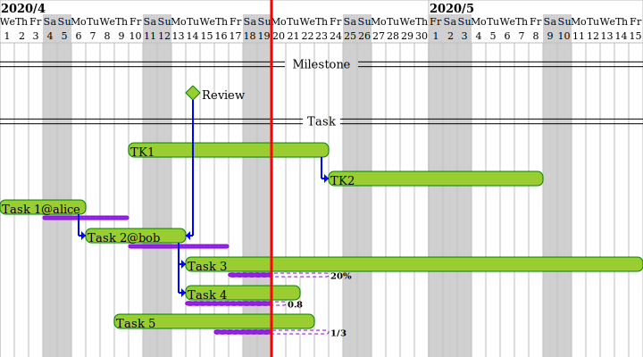

Schedaus
====

A text-based gantt chart drawing tool inspired by PlantUML's Gantt diagram.

## Getting started
### Run
```
git clone <this.repository>
cd schedaus
python -m schedaus.app
```

### Getting an image from text
```
vi gantt.sch
curl http://localhost:5000/sch/svg/$(cat gantt.sch | base64 -w0 | tr / _ | tr + - | tr -d '=')

vi gantt.yaml
curl http://localhost:5000/yaml/svg/$(cat gantt.yaml | base64 -w0 | tr / _ | tr + - | tr -d '=')
```

### Configurations
* SCHEDAUS_PNG_SCALE: The scale for the png image. (default: 1.8)

## Output image


## Input text
### original format
```
project lasts 2020/4/1 to 2020/5/15
saturday are closed
sunday are closed
2020/5/1 is closed
today is 2020/4/20

tasks are colored #CCFF00/#00FF00/#000000/#FF00FF/#000000
milestones are colored blue/black/red/blue/yellow
paths are colored red

-- Milestone --
!milestone1: "Review"
  >! 2020/4/14

-- Task --
TK1
  >> 2020/4/10
  >= 10 days

TK2
  >> TK1's end
  >= 10 days

task1: "Task 1"
  >> project's start
  >= 4 days
  .> 2020/4/4
  .< 2020/4/9
  @alice

task2: 'Task 2'
  >> task1's end
  >< milestone1's start
  .> 2020/4/10
  .= 5 days
  @bob

task3: "Task 3"
  >> task2's end
  >< project's end
  .> 2020/4/17
  .- 20%

task4: "Task 4"
  >> task2's end
  >= 6 days
  .> 2020/4/14
  .- 0.8

task5: "Task 5"
  >> 2020/4/9
  >= 10 days
  .> 2020/4/16
  .- 1/3
```

### yaml format
```yaml
project:
  start: 2020/4/1
  end: 2020/5/15
  closed:
    - sat
    - sun
    - 2020/5/1
  today: 2020/4/20
style:
  color:
    task: "#CCFF00/#00FF00/#000000/#FF00FF/#000000"
    milestone: "blue/black/red/blue/yellow"
    path: "red"
task:
  - name: TK1
    plan:
      start: 2020/4/10
      period: 10 days
  - name: TK2
    plan:
      start: TK1's end
      period: 10 days
  - name: task1
    text: "Task 1"
    plan:
      start: project's start
      period: 4 days
    actual:
      start: 2020/4/4
      end: 2020/4/9
    assignee: alice
  - name: task2
    text: "タスク2"
    plan:
      start: task1's end
      end: milestone1's start
    actual:
      start: 2020/4/10
      period: 5 days
    assignee: bob
  - name: task3
    text: "Task 3"
    plan:
      start: task2's end
      end: project's end
    actual:
      start: 2020/4/17
      progress: 20%
  - name: task4
    text: "Task 4"
    plan:
      start: task2's end
      period: 6 days
    actual:
      start: 2020/4/14
      progress: 0.8
  - name: task5
    text: "Task 5"
    plan:
      start: 2020/4/9
      period: 10 days
    actual:
      start: 2020/4/16
      progress: 1/3
milestone:
  - name: milestone1
    text: "Review"
    plan: 2020/4/11
group:
  - text: Milestone
    member:
      - milestone1
  - text: Task
    member:
      - task1
      - task2
      - task3
      - task4
      - task5
      - TK1
      - TK2
```
